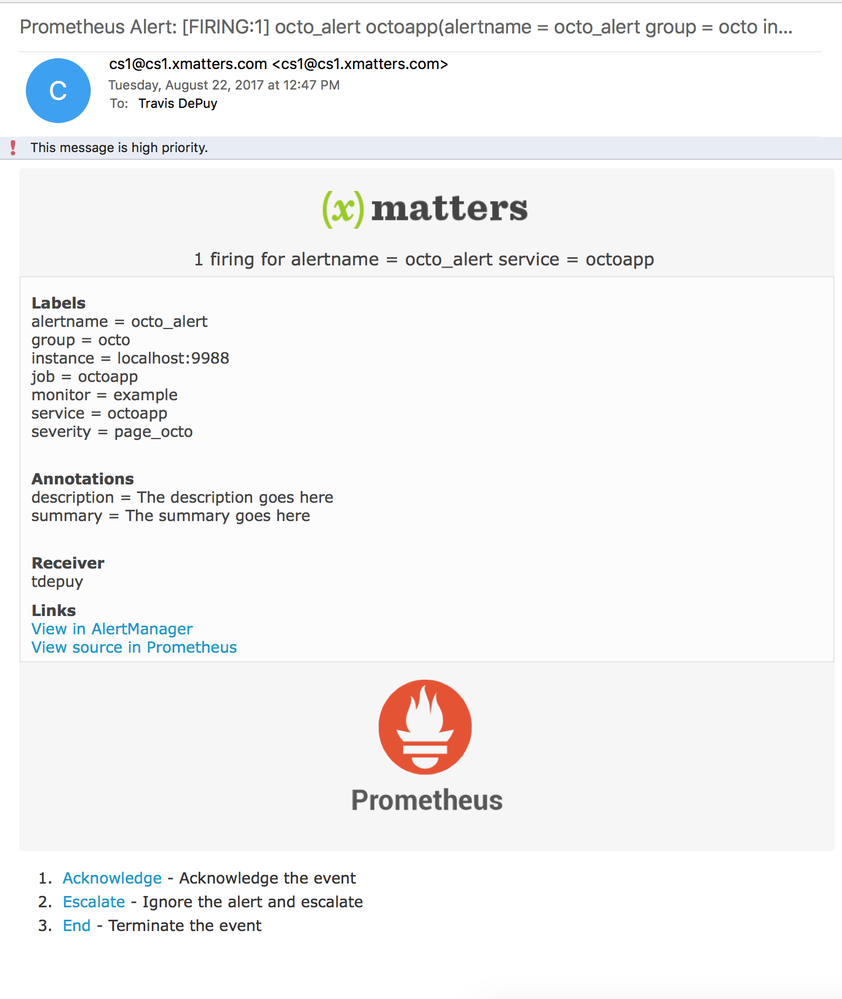

# Prometheus AlertManager
[Prometheus](https://prometheus.io/) is a powerful, open-source monitoring solution. This integration to xMatters extends the alerting capabilities of AlertManager to notify the right people at the right time. 

[](https://youtu.be/cBP7w_NhkBA)

---------

<kbd>
<a href="https://support.xmatters.com/hc/en-us/community/topics">	
	
</a>	
</kbd>

---------


# Pre-Requisites
* Prometheus with [AlertManager](https://github.com/prometheus/alertmanager) set up and running. 
* An application to monitor
* xMatters account - If you don't have one, [get one](https://www.xmatters.com)!

# Files
* [Prometheus.zip](Prometheus.zip) - Workflow for the integration builder script and notification form templates. 

# How it works
[Alerting rules](https://prometheus.io/docs/prometheus/latest/configuration/alerting_rules/) are defined in Prometheus and sent to AlertManager for further processing. The AlertManager [config file](https://prometheus.io/docs/alerting/configuration/#configuration-file) defines what happens after the alerts are sent to AlertManager. A webhook points to an HTTP trigger in xMatters. Once the alert reaches xMatters, the integration builder script transforms the content and builds the event, sets the recipient to the receiver and creates the event. 

# Installation

## xMatters set up
1. Login to the xMatters UI and navigate to the Workflows page. 
2. Click the Import Workflow and select the [Prometheus.zip](Prometheus.zip) file. 
3. Update the Alert Manager Endpoint to the address of your alertmanager, `example.com:9093/api/v2/`


## Prometheus set up
1. Open the `alertmanager.yml` file and navigate to the `receivers` section. The location of the file and the section will depend on the details of the installation. 
2. Add a new receiver. The name of the receiver will be the recipients of the event. For example, to target the `Database` group:

```yaml
- name: 'Database'
  webhook_configs:
    - url: 'https://acme.xmatters.com/api/integration/1/functions/UUID/triggers?apiKey=KEY'
```

3. Edit the route that should target the new receiver. For example, to notifiy this `Database` receiver for the `octoapp` service:

```yaml
  routes:
  - match_re:
      service: ^(octoapp)$
    receiver: Database
```

4. Repeat as needed for new routes and new receivers. 

5. Edit any alert rules (referenced in the file(s) defined in the `rule_files` section of the `prometheus.yml` file) to include a priority annotation, or to include any additional fields required for processing. For example:

```
groups:
- name: alert.rules
  rules:
  - alert: octo_alert
    expr: some_gauge > 30
    for: 20s
    labels:
      service: octoapp
      severity: page_octo
    annotations:
      description: The description goes here
      summary: The summary goes here
```

   The fields inside the `ANNOTATIONS` section are put inside the `annotation_contents` output.

# Testing
Create or edit an Alert Rule in the alert rules file (defined in the `prometheus.yml` file) that is easy to fire. For example, to fire when the `widget_gauge` is greater than 30 for 1 minute:

```
groups:
- name: alert.rules
  rules:
  - alert: octo_alert
    expr: some_gauge > 30
    for: 20s
    labels:
      service: octoapp
      severity: page_octo
    annotations:
      description: The description goes here
      summary: The summary goes here
```

Then in the monitored application, get the `some_gauge` value above 30 for 1 minute. This will trigger an alert in AlertManager, and then will be fired off to xMatters. Make sure you have a `Database` group with a user. 

A notification will be sent out targeting the Database group:

TODO: new image here
<kbd>
	
</kbd>


# Troubleshooting
Check the AlertManager log (This depends on installation details) for any errors making the call to xMatters. Then check the Activity Stream in the `Inbound from Prometheus` section for errors. 

## Example
This is the example flow provided in the [Prometheus.zip](Prometheus.zip) Workflow file.

TODO: add example workflow image here
<kbd>
	
</kbd>
